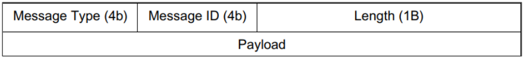

# Simple Chat server (sChat)

این پروژه نرم افزار چت ساده (سرور) است. کاربر به سرور متصل شده و نام خود را ارسال می کند. پر صورتی که ارسال نکند اتصال حذف می شود. پس از دریافت نام کاربر توسط سرور یک thread برای آن کاربر اختصاص می یابد.

برای مدیریت کاربران یک map شامل نام کاربری و یک struct به شکل زیر داریم:

```
struct User_t
{
    uint16_t user_id;
    std::map<uint16_t ,std::string> new_messages;
    bool is_online = false;
};

std::map<std::string, User_t *> _users;
```

تمامی پیام های ارسال شده برای هر کاربر تا قبل از دریافت شدن در new_messages خواهند ماند بدین شکل حتی پس از آفلاین شدن کاربر هم داده های مربوط به کاربر در سرور باقی خواهد ماند و در زمان آنلاین شدن کاربر می تواند پیام های خود را دریافت کند.

ساختار کلی پیام ها به شکل زیر است:



مقدار Message Type از enum زیر خواهد بود:

```
typedef enum
{
    CONNECT,
    CONNACK,
    LIST,
    LISTREPLY,
    INFO,
    INFOREPLY,
    SEND,
    SENDREPLY,
    RECEIVE,
    RECEIVEREPLY,
    ERROR
} Message_t;
```

مقدار Message id همواره 0 است مگر در زمان دریافت پیام ها از سرور (RECEIVE) که پیام اول در این حالت برابر تعداد پیام های خوانده نشده و برای پیام های بعد همواره یکی کمتر از پیام قبل خواهد بود.

