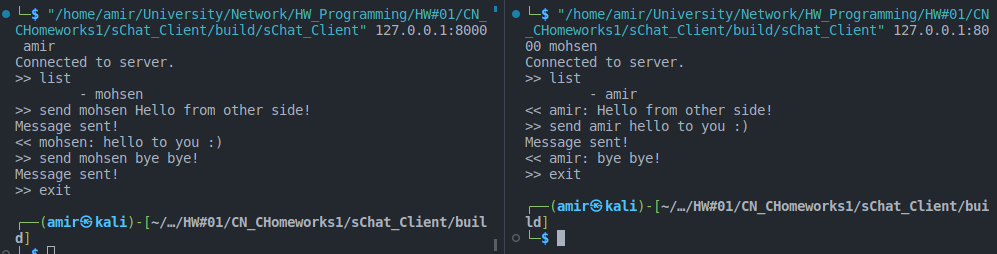

# Simple Chat client (sChat Client)

این نرم افزار مشتری (client) پروژه sChat است در این نرم افزار یک thread دستورات را از کاربر دریافت و یک thread هر ۲ ثانیه توسط تابع recv_th پیام های جدید را از سرور دریافت می کند.

تمامی کد ها در فایل main.cxx به صورت self-descriptive قرار دارند.

ساختار پیام ها دقبقا طبق فایل Computer Network- Programming 01.pdf موجود در صفحه اصلی repository تمرین هستند.

## اسکرین شات برنامه



## حداقل موارد لازم برای نصب کامپایل و اجرا

حداقل موارد مورد نیاز:

1. OS: linux (developed and tested on Kali) - Debian based distros are recommended
2. Build system: CMake minimum version 3.24 

برای اجرای برنامه پس از کامپایل: 

```
./sChat_Client [SERVERIP]:[SERVERPORT] [USERNAME]
```