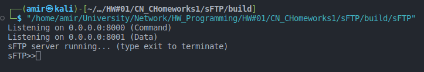

# Simple FTP (sFTP)

## 1. مقدمه
این پوشه شامل بخش سرور sFTP است. در این سرور از دو سوکت برای برقراری ارتباط با هر مشتری (Client) استفاده می شود.  
1. سوکت دستور: تمامی دستورات از طریق این سوکت برای سرور ارسال می شود  
2. سوکت داده: برای ارسال و دریافت فایل این سوکت متصل و پس از انتقال فایل بسته می شود

## 2. شیوه کار
در این بخش به نحوه کلی کار سامانه و ارتباطات کاربر پ سرور پرداخته می شود. (برای مشاهده داده های فنی و کدها به بخش 3 مراجعه کنید.)
### 2.1 اتصال کاربر
ابتدا مشتری به سوکت دستور سرور متصل می شود. سرور برای مشتری یک thread اختصاصی ایجاد می کند. از این پس تمامی اطلاعاتی که از طریق سوکت دستور ارسال شود توسط سرور بررسی می شود.  
 
 دستورات مجاز: دستوراتی که توسط سرور پشتیبانی می شود به دو دسته Anonymous و دستورات عادی تقسیم می شوند.
 
 دستورات Anonymous:
 1. USER
 2. PASS
 3. HELP
 4. EXIT  
 
 پس از اتصال به سرور مشتری می تواند راهنمای استفاده که شامل ساختار دستورات و پارامترهای هر دستور و مثال های استفاده از دستورات است را با دستور HELP مشاهده کند.
 و یا با دستور EXIT از سرو رخارج شود.

 برای ورود به سرور مشتری ابتدا دستور USER و سپس PASS (دقبقا به همین ترتیب) را برای سرور طبق راهنما ارسال می کند. پس از آن کاربر می تواند از دستورات مخصوص کاربر استفاده کند.

 دستورات مخصوص کاربران: 
 1. RETR
 2. UPLOAD
 3. QUIT

 دستور RETR برای دانلود فایل از سرور و UPLOAD برای ارسال فایل از کامپیوتر کاربر به سرور است. دستور QUIT کاربر را از اکانت فعلی خارج می کند.

 ### 2.2 ارسال و دریافت فایل
برای ارسال و دریافت فایل نرم افزار Client ابتدا درخواست مربوطه را برای سرور ارسال می کند و در پاسخ کد 227 یا 228 را دریافت می کند. سپس به سوکت داده متصل شده و از سرور ID اتصال داده را دریافت می کند. برای شروع فرآیند ارسال و دریافت این ID باید از طریق اتصال دستور برای سرور ارسال شود.

## 3. داکیومنت های فنی
در این بخش ساختار کلی پروژه و کدها و تابع ها بررسی می شود.

### 3.1 ساختار پروژه
فایل های پروژه در پوشه ROOT و CORE و DEPENDENCIES قرار گرفته اند:  
1. در ROOT پروژه تنها فایل main.cxx قرار دارد. نقطه ورودی برنامه این فایل است.

2. فایل های پوشه DEPENDENCIES فایل های مربوط به کتابخانه های خارجی استفاده شده در پروژه شامل کتابخانه RapidJSON و Date است.  

2. فایل های پوشه core فایل های اصلی سرور هستند.

#### 3.1.1 config_man.cxx/.hxx
این فایل برای کار با فایل config.json و کتابخانه RapidJSON ایجاد شده است. 

#### 3.1.2 log_man.cxx/.hxx
عملیات ثبت لاگ های سیستم در این فایل انجام می شود.

#### 3.1.3 net_man.cxx/.hxx
توابع کار با سیتم کال های شبکه مانند soketو listenو bindو ... در این فایل ها قرار دارند.
#### 3.1.4 socket_man.cxx/.hxx
تمام عملیات مدیریت کاربران و پردازش دستورات توسط این فایل و کلاس sock_man انجام می شود.
#### 3.1.5 types.hxx
ساختار ها (Structures) مورد نیاز برنامه در این فایل تعریف شده اند. مانند: User_t
#### 3.1.6 utilities.cxx/.hxx
توابع مربوط رشته ها و فایل سیستم لینوکس در این فایل ها قرار دارند.

### 3.2. توابع
در این بخش توابع مهم و پارامتر های آنها بررسی می شود.

#### 3.2.1. get_socket (net_man.cxx/.hxx)
```
int get_socket(int port, std::string name, logger &log_man)
```
این تابع یک سوکت روی پورت داده شده به آن ایجاد و توسط کلاس log_man ورودی خطاها و یا موفقیت عملیات را لاگ می کند. این تابع همچنین تابع set_socket_options را صدا می زند.
```
void set_socket_options(int socket_fd)
```
این تابع برخی تنظیمات را برای سوکت ایجاد شده قرار می دهد. در این پروژه SO_REUSEADDR برای جلوگیری از رفتن پورت به حالت Wait پس از بسته شدن سرور و SO_RCVTIMEO برای تنظیم تایم اوت تابع recv روی ۲ ثانیه استفاده می شود.

#### 3.2.2. test_socket (net_man.cxx/.hxx)
```
bool test_socket(uint16_t port)
```
این تابع یک اتصال loopback به port ایجاد می کند تا عملیاتی بودن پورت را آزمایش کند.

#### 3.2.3. socket_man::run (socket_man.cxx/.hxx)
```
void socket_man::run(uint16_t data_port, uint16_t cmd_port)
```
این تابع thread های دستور و داده را برای گوش دادن و accept درخواست های ورودی ایجاد و صحت اتصال پورت ها را از طریق تابع test_socket بررسی می کند. در صورت درست بودن همه موارد دستورات مدیر سرور را دریافت می کند. در حال حاضر تنها دستور exit پشتیبانی می شود.

#### 3.2.4. socket_man::accept_data (socket_man.cxx/.hxx)
```
void socket_man::accept_data(int data_socket)
```
این تابع توسط تابع run و در thread مجزا اجرا می شود و منتظر درخواست های مربوط به باز شدن کانال داده ی شود. در صورتی که درخواستی داده شود آنرا پذیرفته (accept) و ID اتصال برای آن ایجاد و ارسال می کند. در حال حاضر برای سادگی همان fd مربوط به socket به عنوان ID ارسال می شود.

#### 3.2.5. socket_man::accept_cmd (socket_man.cxx/.hxx)
```
void socket_man::accept_cmd(int cmd_socket)
```
این تابع توسط تابع run و در thread مجزا اجرا می شود و منتظر درخواست های مربوط به باز شدن کانال دستور می شود. پس از دریافت هر درخواست اتصال آنرا پذیرفته و در یک thread مجزا قرار می دهد.

ورودی این تابع fd سوکت دستور است.

#### 3.2.6. socket_man::client_handler (socket_man.cxx/.hxx)
```
void socket_man::client_handler(int client_cmd_fd, std::string client_ip)
```

این تابع توسط تابع accept_cmd در یک thread مجزا اجرا شده و منتظر دستورات کاربر می شود. 
ورودی های این تابع fd مربوط به سوکت داده مشتری و آیپی مشتری (برای لاگ های سرور) می شود.


## 3.3. نتایج پروژه
اسکرین شات اجرای سرور:  

  
نمونه لاگ های سرور:

```
info :: 2023-01-10 14:06:18.171787637 (UTC) :: main :: Server started.
info :: 2023-01-10 14:06:18.172169010 (UTC) :: socket_man.accept_data :: Client requested data connection. IP: 127.0.0.1
info :: 2023-01-10 14:06:18.172267778 (UTC) :: socket_man.client_handler :: Client disconnected. IP: 127.0.0.1
info :: 2023-01-10 14:08:07.226348366 (UTC) :: socket_man.accept_cmd :: Client connected to server. IP: 127.0.0.1
info :: 2023-01-10 14:09:08.581171088 (UTC) :: socket_man.client_handler :: Client: Mohsen, Logged in successfully, IP: 127.0.0.1
info :: 2023-01-10 14:09:29.708112189 (UTC) :: socket_man.accept_data :: Client requested data connection. IP: 127.0.0.1
info :: 2023-01-10 14:09:29.711819446 (UTC) :: socket_man.client_handler :: Client: Mohsen, downloaded file: test.txt, IP: 127.0.0.1
info :: 2023-01-10 14:09:45.398714598 (UTC) :: socket_man.client_handler :: Client: Mohsen, logged out
info :: 2023-01-10 14:09:54.754547871 (UTC) :: socket_man.client_handler :: Client: Ali, Logged in successfully, IP: 127.0.0.1
info :: 2023-01-10 14:10:12.124779090 (UTC) :: socket_man.accept_data :: Client requested data connection. IP: 127.0.0.1
info :: 2023-01-10 14:10:12.129001826 (UTC) :: socket_man.client_handler :: Client: Ali, uploaded file: test-up.txt, IP: 127.0.0.1
info :: 2023-01-10 14:10:29.463539296 (UTC) :: socket_man.client_handler :: Client: Ali, logged out
info :: 2023-01-10 14:10:31.506793750 (UTC) :: socket_man.client_handler :: Anonymous client requested exit. IP: 127.0.0.1

```
برای مشاهده نمونه لاگ فایل به فایل sFTP-sample.log مراجعه کنید.

## 3.4. حداقل موارد لازم برای نصب کامپایل و اجرا

1. OS: linux (developed and tested on Kali) - Debian based distros are recommended
2. Build system: CMake minimum version 3.24 