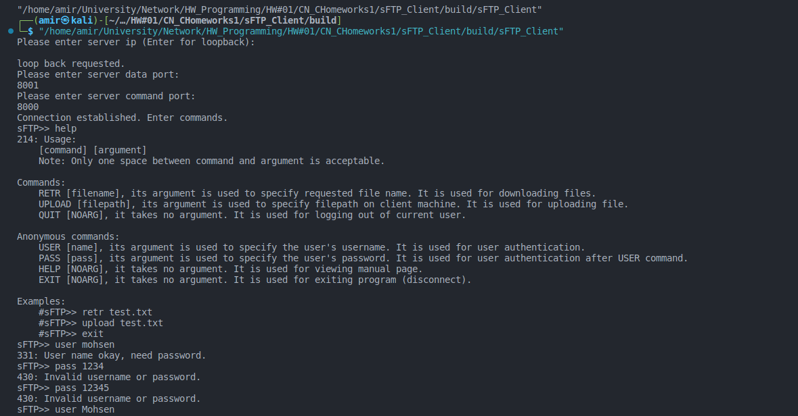
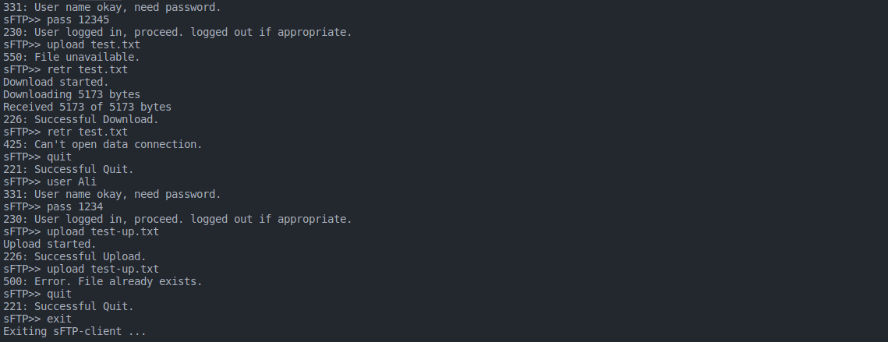

# sFTP Client

## 1. مقدمه
این پروژه بخش مشتری (client) سرور sFTP است. (برای مشاهده نحوه کار کلی به پروژه sFTP مراجعه کنید.)

## 2. داکیومنت های فنی
در این بخش ساختار کلی پروژه و کدها و تابع ها بررسی می شود.

### 2.1 ساختار پروژه
فایل های پروژه در پوشه ROOT و CORE  قرار گرفته اند:  
1. در ROOT پروژه تنها فایل main.cxx قرار دارد. نقطه ورودی برنامه این فایل است.

2. فایل های پوشه core فایل های اصلی برنامه هستند.

#### 2.1.1 socket_man.cxx/.hxx
توابع ارسال و دریافت فایل همچنین اتصال به سرور در این فایل قرار دارد. سیستم کال های socketو connect در این توابع فراخوانی می شوند.

#### 2.1.2 utilities.cxx/.hxx
توابع مربوط رشته ها و فایل سیستم لینوکس در این فایل ها قرار دارند.

## 2.2 توابع مهم
در این بخش توابع مهم بررسی می شوند.

### try_to_connect (socket_man.cxx/.hxx)
```
bool try_to_connect(uint16_t *data_port, std::string *server_ip, int *cmd_fd, bool *is_loopback)
```
این تابع از کاربر آدرس سرور و شماره پورت های داده و دستور را گرفته و اتصال با سرور را (درصورت امکان) برقرار می کند. در صورت بروز خطا به کاربر اطلاع داده و در صورت نیاز دوباره فرآیند اتصال را اجرا می کند.

### send_to_socket (socket_man.cxx/.hxx)
```
void send_to_socket(int socket_fd, uint16_t code, char *message, uint32_t size)
```
به سوکت socket_fd پیام message با سایز size و کد code را ارسال می کند.

### receive_from_socket (socket_man.cxx/.hxx)
```
size_t receive_from_socket(int socket_fd, char *data, uint16_t *code, bool verbose)
```
از سوکت socket_fd دیتای data را دریافت و طول آنرا بر می گرداند. code کد ارسالی از سرور است و verbose در صورت true بودن اطلاعات مربوط به فرآیند دریافت را روی کنسول چاپ می کند. (در فرآیند دانلود این پارامتر true است لطفا به بخش نتایج مراجعه کنید.)

### send_file (socket_man.cxx/.hxx)
```
bool send_file(int socket_fd, std::string *file_path)
```
فایل با آدرس file_path را در صورت وجود برای سرور ارسال می کند. socket_fd سوکت داده است و خروجی نشانگر نتیجه ارسال یا عدم ارسال فایل است.

این تابع از send_to_socket برای ارسال فایل استفاده می کند.

### get_file (socket_man.cxx/.hxx)
```
bool get_file(int socket_fd, std::string *filename)
```
فایل با نام filename را در صورت وجود از سرور دانلود می کند. socket_fd سوکت داده است و خروجی نشانگر نتیجه دانلود یا عدم دانلود موفق فایل است.

این تابع از receive_from_socket برای دانلود فایل استفاده می کند.

## 3. نتایج پروژه
اسکرین شات اجرای سرور:  



## 4. حداقل موارد لازم برای نصب کامپایل و اجرا

1. OS: linux (developed and tested on Kali) - Debian based distros are recommended
2. Build system: CMake minimum version 3.24 