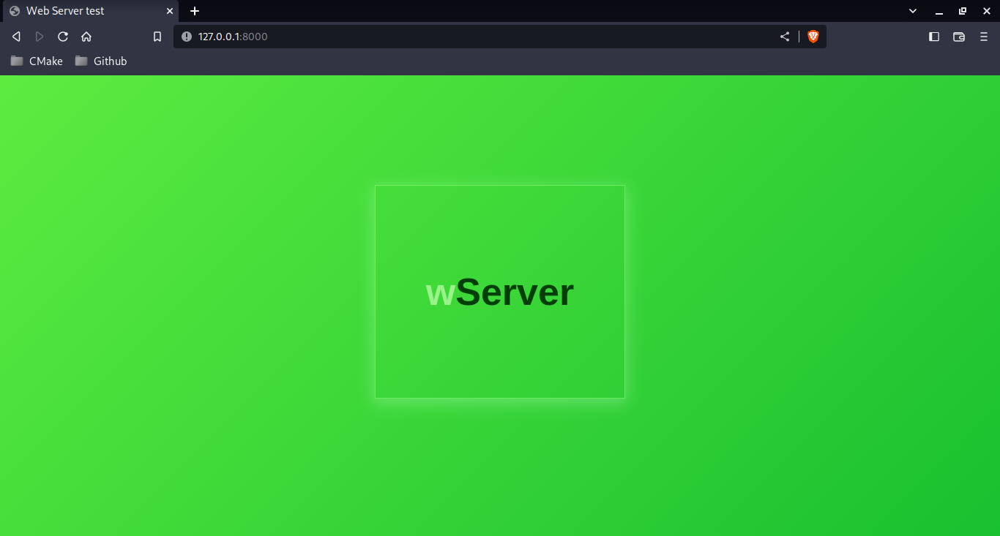
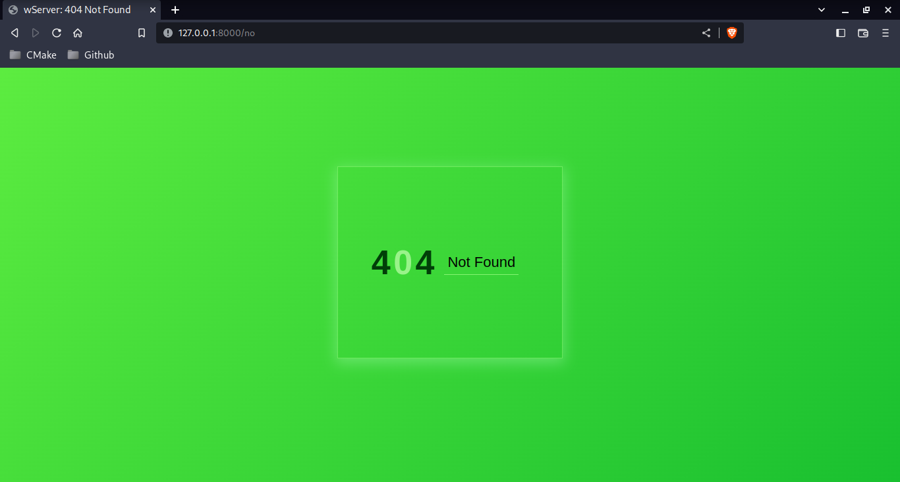

# Simple Webserver

## 1. مقدمه
در این پروژه یک وبسرور ساده پیاده سازی شده است. این وبسرور درخواست ها را از مرورگر دریافت و پاسخ می دهد.

فایل های زیر توسط سرور پشتیبانی می شوند:

1. HTML
2. CSS
3. JS
4. JPG/JPEG
5. GIF
6. MP3
7. PDF

پس از اجرای سرور به آدرس 127.0.0.1:8000 مراجعه کنید.

## توابع و کتابخانه ها
در این پروژه از کتابخوانه خارجی استفاده نشده است. برای Parse درخواست های مرورگر و serilize پاسخ های سرور توابع زیر در فایل html.cxx/.hxx پیاده سازی شده است:

```
void http_parse_request(std::string raw_request, HttpRequest_TypeDef &request);

std::string http_serialize_response(HttpResponse_TypeDef &response);
```

ساختار های استفاده شده در توابع بالا به شرح زیر هستند:

```
typedef struct
{
    std::string verb;
    std::string target;
    std::string version;
    std::map<std::string, std::string> header;
    std::string body;
} HttpRequest_TypeDef;

typedef struct
{
    std::string status_string;
    int status_code;
    std::string version;
    std::map<std::string, std::string> header;
    std::string body;
} HttpResponse_TypeDef;
```

در تابع main پروژه واقع در فایل main.cxx درخواست های مرورگر پذیرفته (accept) شده و هر سوکت ایجاد شده در thread مجزا توسط تابع serve واقع در فایل server.cxx/.hxx مدیریت می شود.

تمامی thread های ایجاد شده توسط main در thread_pool نگهداری و پس ار پایان کار حذف می شوند.

تابع زیر درخواست های مرورگر را مدیریت می کند:

```
void serve(int client, void (*remove_thread)(int))
```

در تابع بالا client همان fd سوکت ای است که مرورگر به آن متصل شده است و remove_thread یک پوینتر به تابعی است که serve پیش از پایان کار خود برای حذف از thread_pool اجرا می کند.

سرور پس از دریافت درخواست مرورگر با استفاده از توابع موجود در کتابخانه http.cxx/.hxx قسمت های مختلف درخواست را استخراج کرده و فایل مدنظر را همراه هدر های لازم برای مرورگر ارسال می کند. در صورت عدم وجود فایل صفحه 404.html برای کاربر ارسال می شود.

## 3. نتایج
اسکرین شات اجرای سرور:   



با اجرای صحه اصلی فایل های HTML و JS و CSS صفحه اصلی از سرور دریافت می شوند. برای اطمینان از صحت عملکرد روی لوگوی سرور کلیک کنید.

برای تست سایر فایل های پشتیبانی شده پس از اجرای موفق سرور به آدرس های زیر مراجعه کنید:

1. PDF: http://127.0.0.1:8000/test.pdf 
2. CSS: http://127.0.0.1:8000/test.css
3. JS : http://127.0.0.1:8000/test.js
4. gif: http://127.0.0.1:8000/test.gif
5. jpeg: http://127.0.0.1:8000/test.jpeg
6. mp3: http://127.0.0.1:8000/test.mp3
6. html: http://127.0.0.1:8000

## 4. حداقل موارد لازم برای نصب کامپایل و اجرا

1. OS: linux (developed and tested on Kali) - Debian based distros are recommended
2. Build system: CMake minimum version 3.24 